<p align="center">
  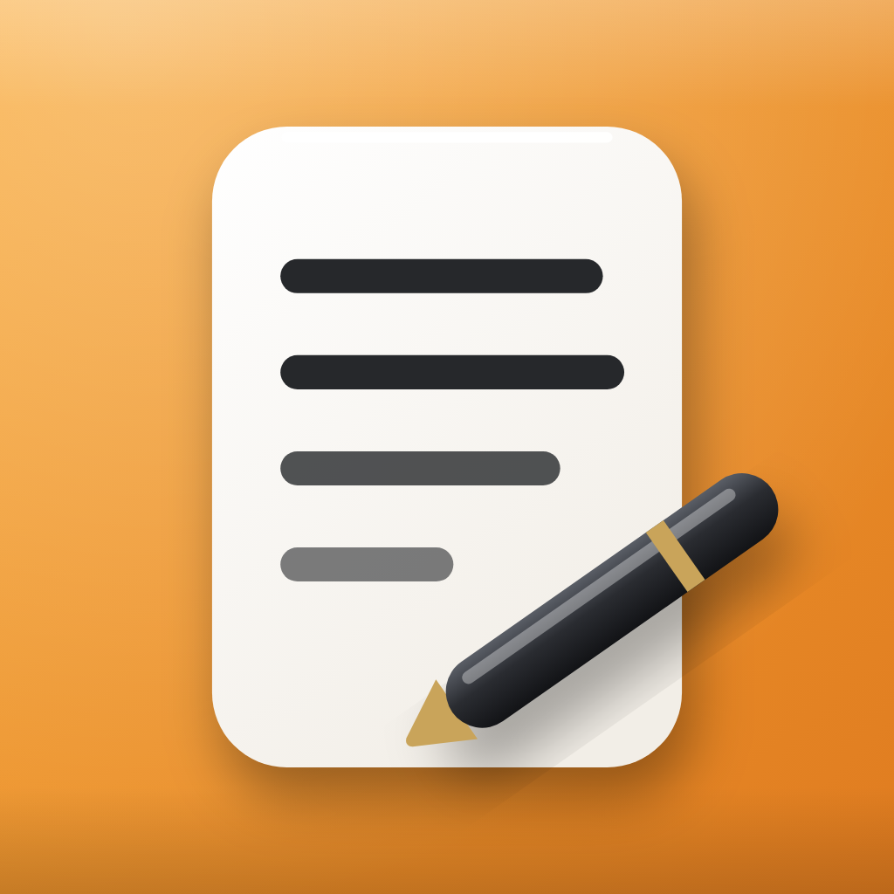
</p>

<h1 align="center">Inkwell</h1>

<p align="center">
  The handwriting notebook for Android tablets.<br />
  Private, near-instant ink, and yours to shape.
</p>

<p align="center">
  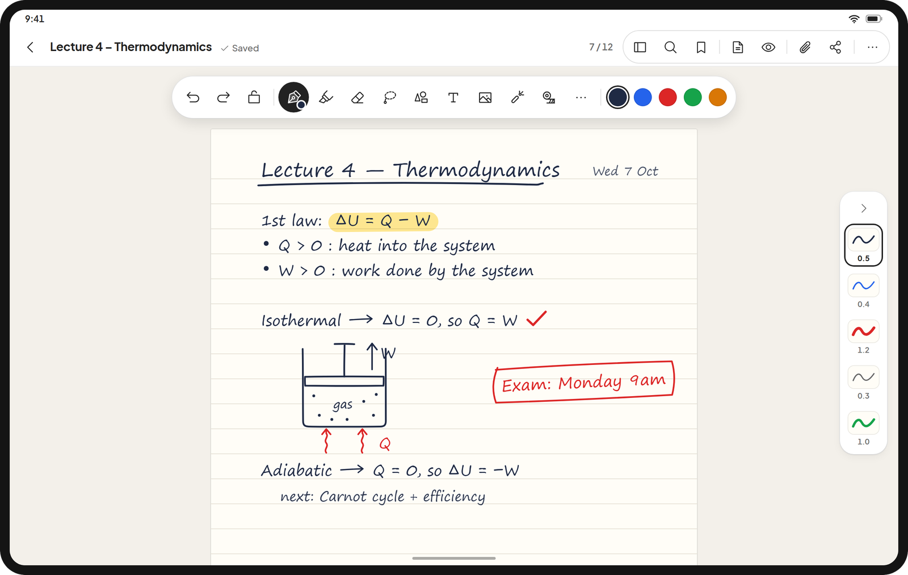
  <br />
  <em>Lecture notes in Inkwell: handwriting, highlights and diagrams, with your pens one tap away</em>
</p>

Inkwell is a notebook for people who think with a pen. The ink stays under the nib, the pages feel like paper, and everything you write stays editable. Move it, restyle it or erase it whenever you like.

## Why I built Inkwell

I always wanted a perfect note-taking app, but none of the apps out there met my needs. I was even paying for a subscription and still wasn't happy with the writing experience.

So, after weighing up what was possible, I started building my own. Claude Opus 5.5 sped up the process a hundredfold.

I've also long wanted to give something back to the open-source community. It has given me so many great apps that I've relied on for years.

I hope you'll like Inkwell. If there's anything you'd like to see, let me know.

## Private by design

No account, no ads, no analytics. Your notes are plain files in a folder you choose, never uploaded anywhere. They aren't locked in a database, so you can back them up, sync them or move them with any tool you like.

<sub>The optional document scanner uses Google Play services.</sub>

## Near-zero latency

Ink is drawn straight to the screen, outside the normal frame queue, with a predicted stroke just ahead of the nib, so the line stays under your S Pen. The pens, pencil and lasso stay smooth on long, fast strokes, and the cost stays flat however long the stroke gets.

## A state-of-the-art writing experience

- **Six pens:** fountain, ballpoint, brush, calligraphy, dashed, and a **textured pencil** whose graphite darkens as you press.
- **Highlighter and study tape:** hold to straighten a highlight; tape hides answers until you peel it back.
- **Palm rejection:** rest your hand on the screen and write.
- **Shape snapping:** draw, hold, and it snaps to a clean line, arrow, circle or box. Drag a line's ends anywhere.
- **Sharp at any zoom,** with zoom lock on the toolbar.

<table>
  <tr>
    <td width="50%">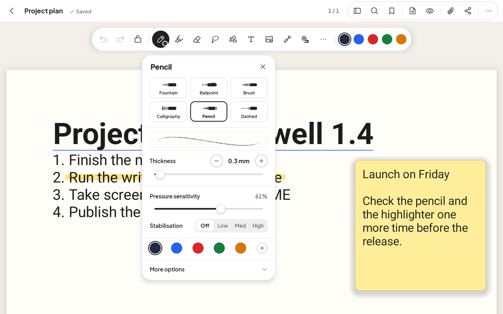<br /><em>The pen card: six pens, including the textured pencil</em></td>
    <td width="50%">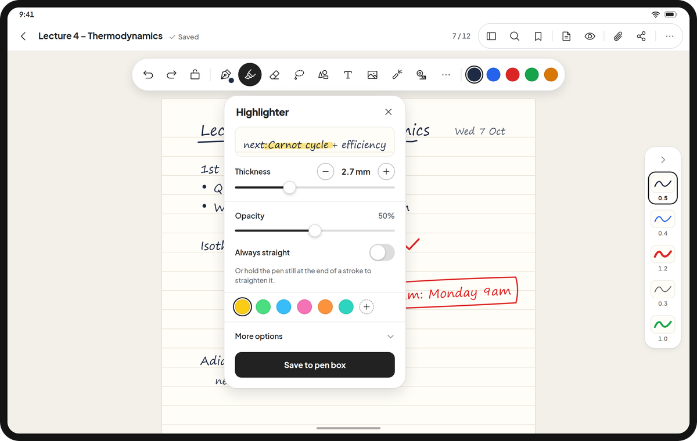<br /><em>Highlighter: opacity, always straight, saved presets</em></td>
  </tr>
  <tr>
    <td>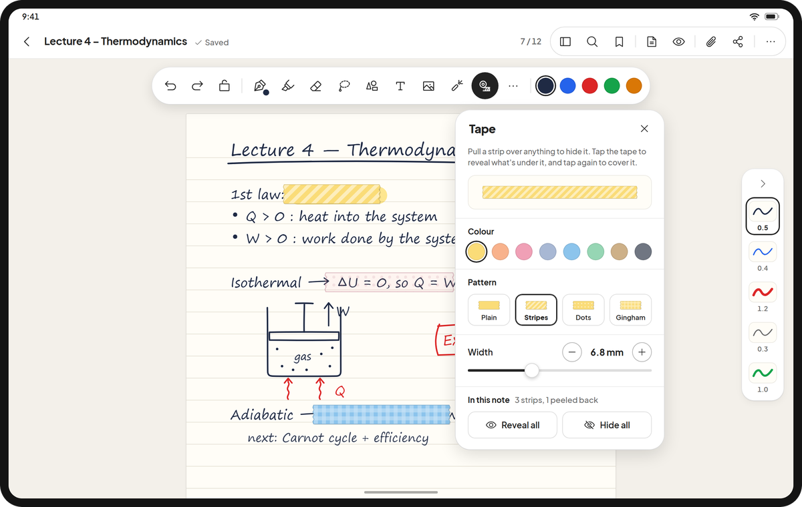<br /><em>Study tape: hide answers, peel back to check</em></td>
    <td>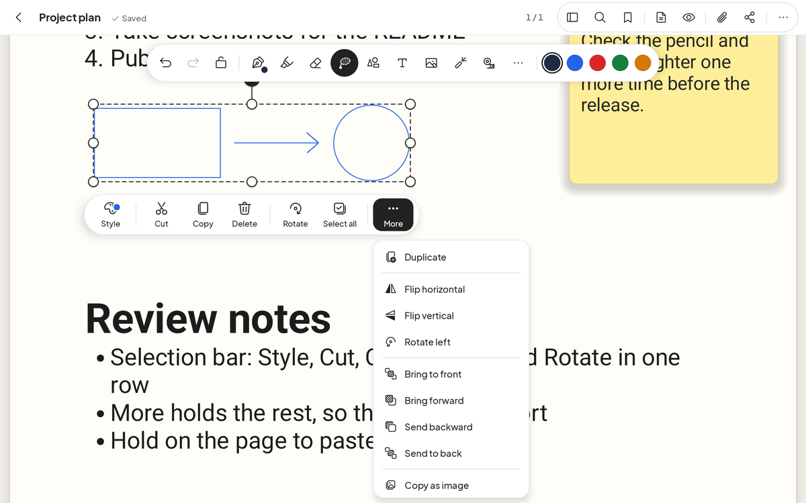<br /><em>Lasso anything, then act from the selection bar</em></td>
  </tr>
</table>

## Unparalleled customisation

- **Toolbar:** rearrange it into sections, show or hide any tool, float it or dock it on any edge, and pick its size.
- **Looks:** Light, Dark and true-black OLED; sharp, rounded or soft corners; any accent colour, dual tone or Material You.
- **Selection bar:** choose which buttons appear for handwriting, pictures, sticky notes, text and tables.
- **Pages:** 20+ templates (Cornell, planners, music staves, isometric and more) with their own colours and spacing, per page or for the whole notebook.
- **Pen box:** save your favourite pens and highlighters as presets.

<table>
  <tr>
    <td width="50%">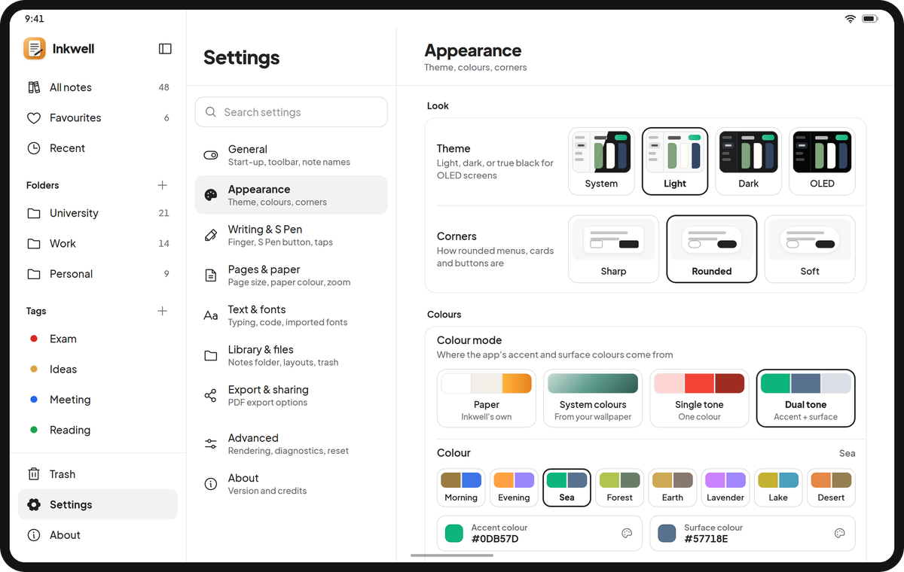<br /><em>Themes, corners and colour modes</em></td>
    <td width="50%">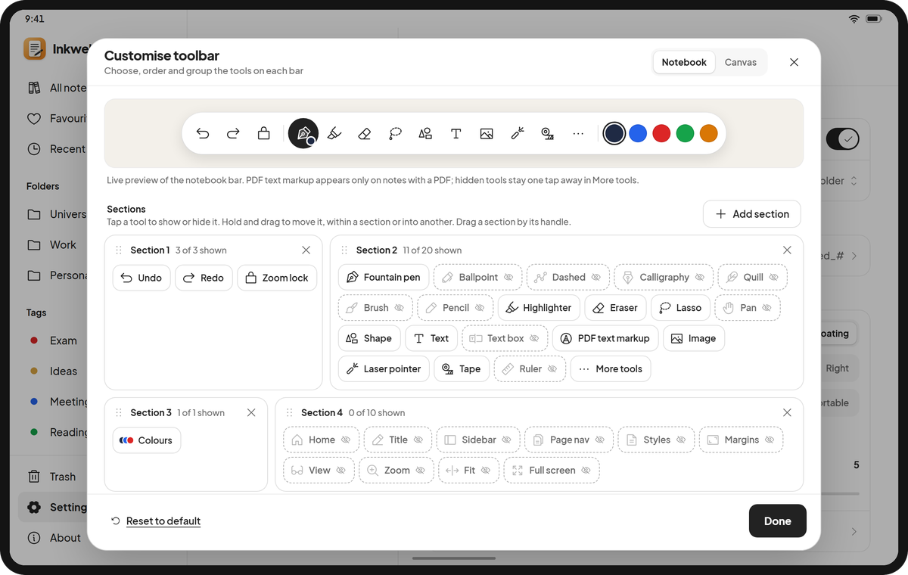<br /><em>Build your own toolbar</em></td>
  </tr>
  <tr>
    <td>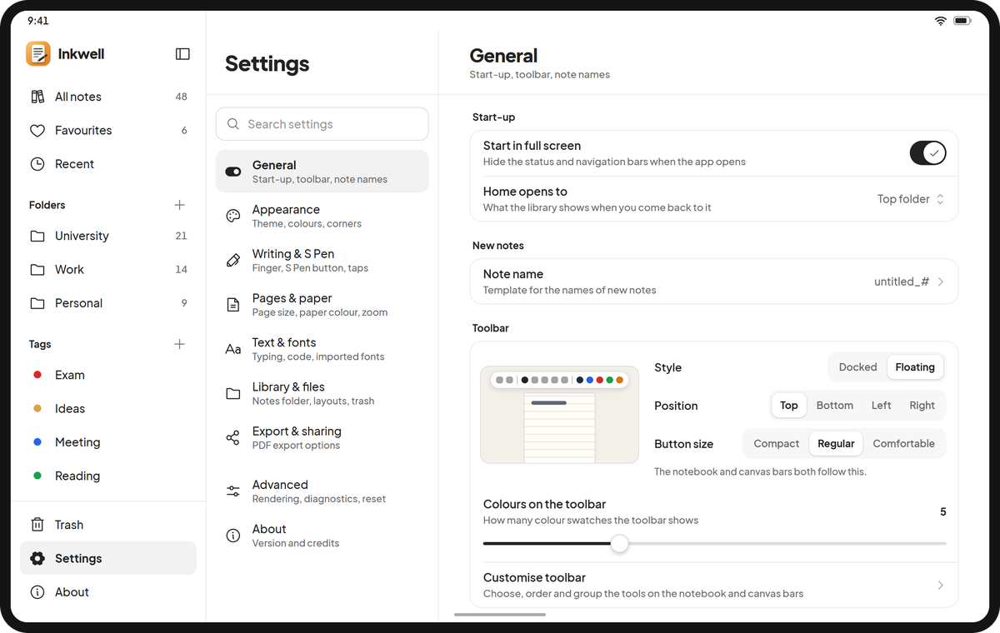<br /><em>Toolbar style, position and size</em></td>
    <td>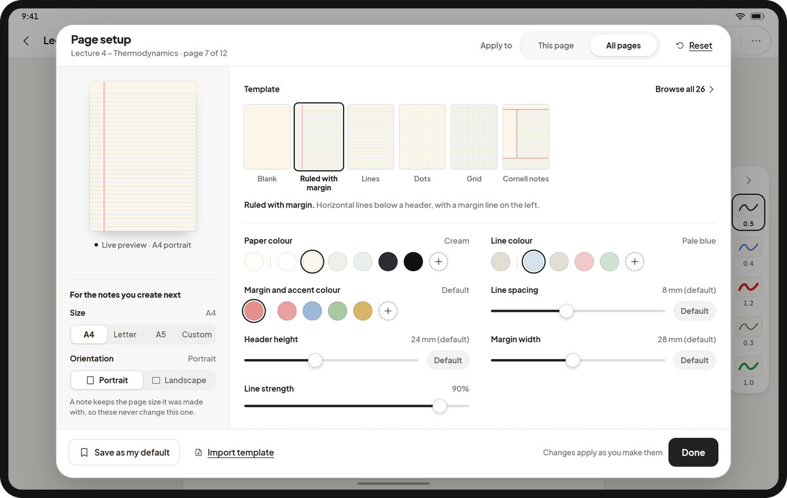<br /><em>Page templates with their own colours and spacing</em></td>
  </tr>
</table>

## More than handwriting

- **Notebooks and an infinite canvas:** pages when you want structure, endless space when you don't.
- **PDFs:** import any PDF and write all over it. Highlight and comment on text, search it, widen the margins for side notes, and filter the colours for night reading.
- **Typed notes:** text boxes, sticky notes, tables, checklists, markdown, LaTeX and highlighted code.
- **Images:** insert, crop and arrange them, or scan a document straight in.
- **Audio:** record while you write, then play back with your notes replaying in sync, from 0.5× to 2×.
- **Share:** as a sharp vector PDF with bookmarks, an editable PDF, images or an Inkwell note.
- **Organise:** a library with favourites, tags, search, trash and split view.

<table>
  <tr>
    <td width="50%">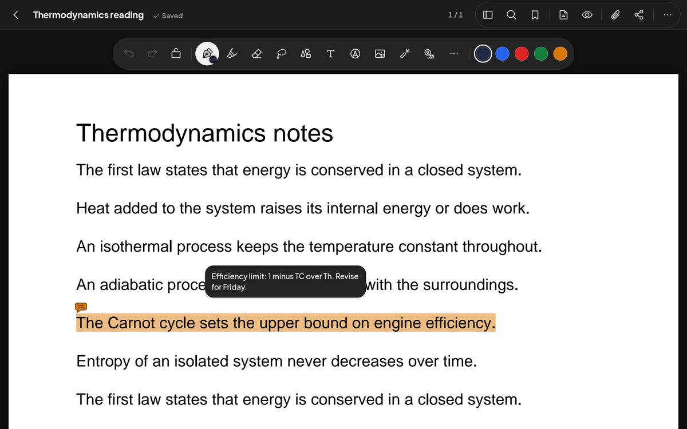<br /><em>Highlight and comment on PDFs, in Dark</em></td>
    <td width="50%">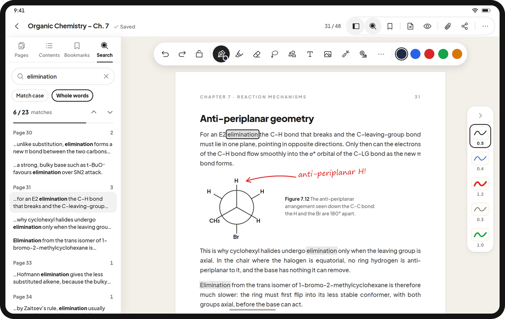<br /><em>Find anything in a note or PDF</em></td>
  </tr>
  <tr>
    <td>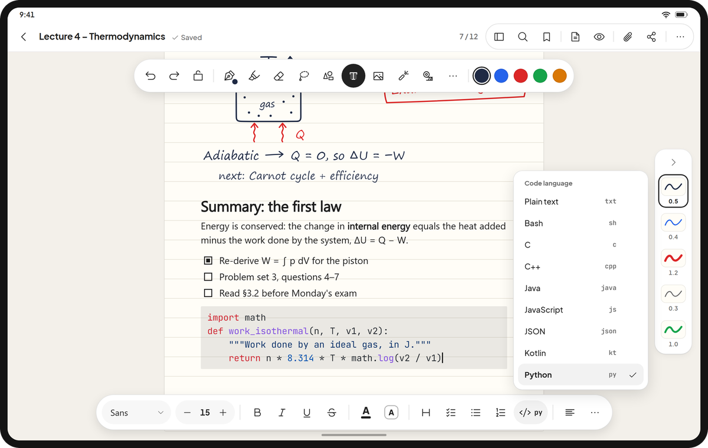<br /><em>Code blocks with syntax highlighting</em></td>
    <td>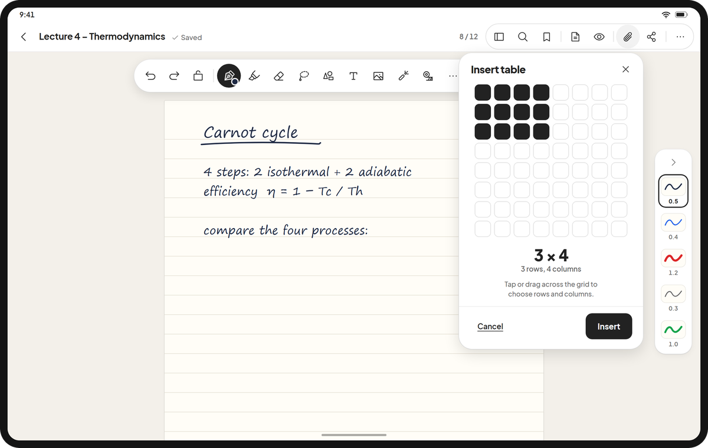<br /><em>Tables in a tap</em></td>
  </tr>
  <tr>
    <td>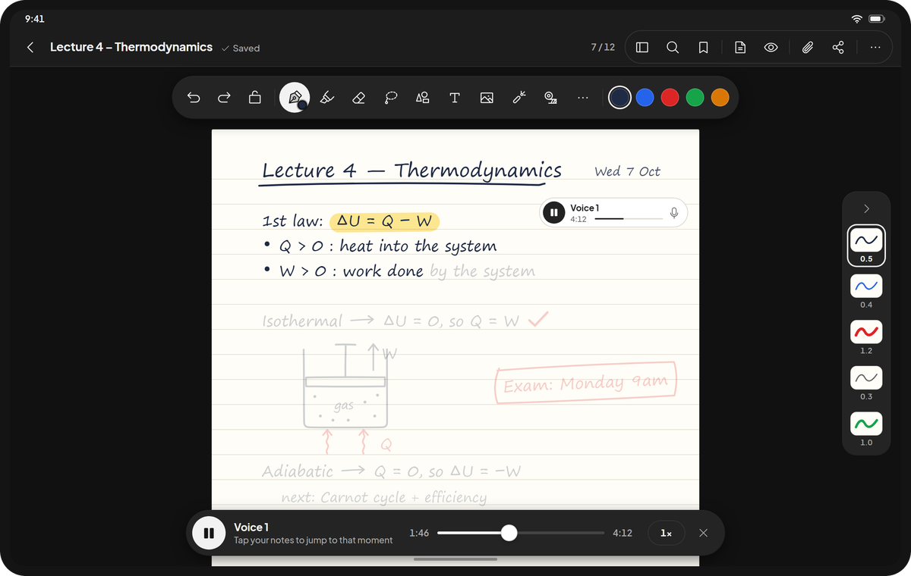<br /><em>Audio that replays your notes in sync</em></td>
    <td>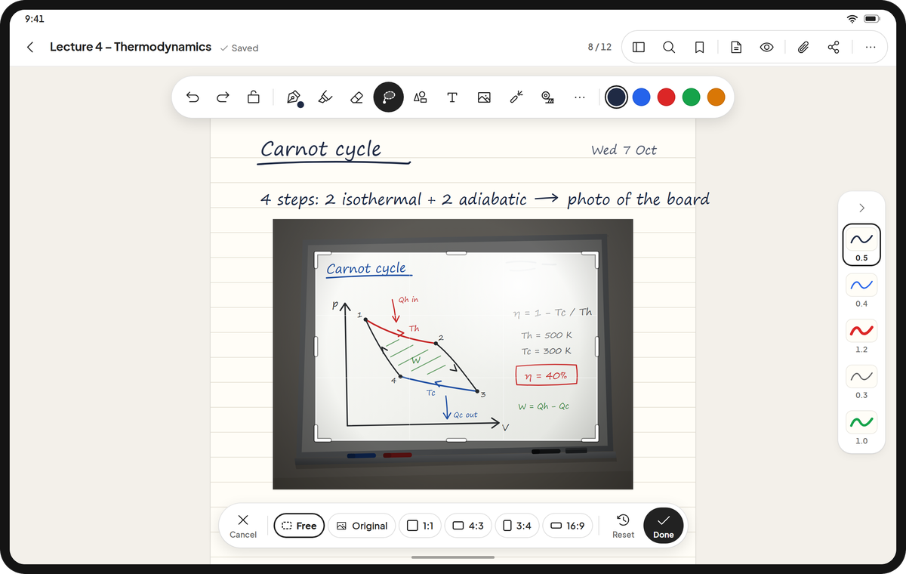<br /><em>Crop images in place</em></td>
  </tr>
  <tr>
    <td>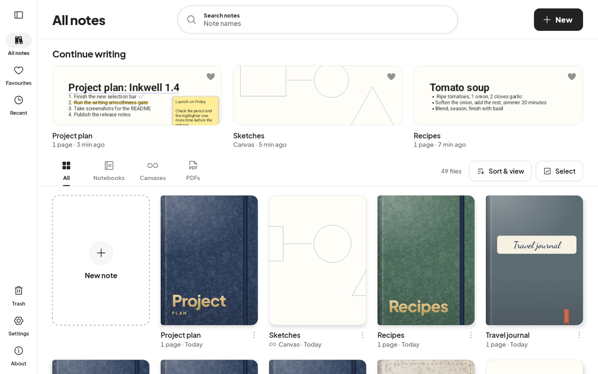<br /><em>Your library</em></td>
    <td>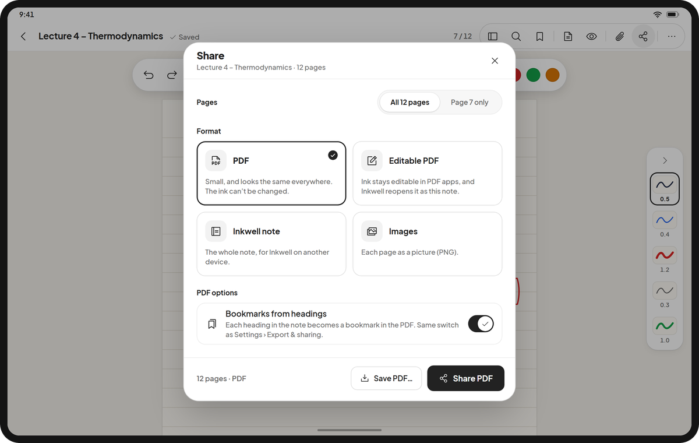<br /><em>Share as PDF, editable PDF, images or a note</em></td>
  </tr>
</table>

## Open source, MIT licensed

Inkwell is free and open source under the MIT License. Fork it, change it, rebrand it, ship your own version or use it commercially. You don't need anyone's permission; just keep the licence notice.

Inkwell is built on top of xnotes, an open-source handwriting app, and adds its own design, tools and features on that foundation.

## Install

Download the latest APK from [Releases](https://github.com/sugampratap/inkwell/releases/latest) and open it on your tablet. Inkwell needs Android 8.0 or later on a 64-bit ARM device, and is tuned on the Galaxy Tab S8 with the S Pen.

## Build from source

Needs JDK 17, NDK 27.0.12077973 and CMake 3.22.1.

```bash
git clone https://github.com/sugampratap/inkwell.git
cd inkwell
./gradlew assembleDebug
```

## License

MIT. See [LICENSE](LICENSE).
